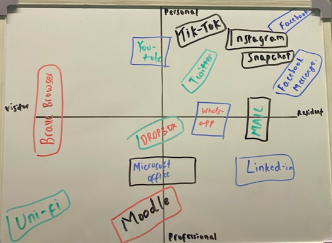

With the introduction of the Web, many people have created their own digital identities leaving a presence of themselves and their work for other people to discover. The internet can be and has been used as a place to promote yourself as an individual with certain skills which can be tailored to specific industries and can get you paid (freelancing). Digital identities are the presences we leave or “footprints” which enable other people to see what we have done, or the things we are doing or even create a community for people of a certain society to talk, discuss or even create.

Digital identities are ideas solidified through the introduction of the web and how technology is integrated in our everyday lives. Prensky (2001) discusses his ideas on digital identities by distinguishing two key factors being: digital natives and digital immigrants. The terms natives and immigrants are used to help identify the difference between generation z and previous generations e.g Generation X and Baby boomers (BBC learn and Revise) and how people born into technology are known to essentially be “natives” with technology being integrated in their everyday lives as if it were a language. Whereas older generations had to learn how to utilise this and adapt essentially making them immigrants. White (2013) on the other hand discusses an alternate version of Prensky’s “digital natives and digital immigrants” through Visitor and Resident modes and how everyone uses the web differently, some leaving online presences and others using the web as a tool to find what they are looking for. White also suggests using a V&R map to help us visualise each platform we use on the web and categorise them to visitor/ resident and personal/professional. The V&R map helps us discuss the difference between visitor and resident modes as well as the distinction between private and professional presences online.

White’s V&R concept is beneficial as the dimensions between visitor/resident and personal/professional essentially helps us divide our presences into four between our professional or private lives which may be accessed by employers, work colleagues or family members and friends. With the visitor/ resident dimension which discuss the way we use the web and certain platforms in our daily lives. The main disadvantage of the web and the internet is privacy. It is very easy to access information about anyone and anything but these dimensions act as a boundary helping us acknowledge and understand which platforms, we want to keep personal or professional. By understanding this I have been able to create my own V&R map explaining each platform I use and how I plan to improve my digital identity in the upcoming future.

Figure 1:

    

The V&R map above shows how I have identified how I engage with the web in my visitor/ resident mode as well as which platforms I use for professional or personal reasons (see figure 1).

My current V&R map shows the different platforms I use daily and how my online presence revolves around the personal/resident bracket using different social media such as Instagram, WhatsApp, and Snapchat. My personal visitor mode is mainly brave browser which I use frequently to find information for my university course or just generally. Currently, my professional resident and visitor quadrant is quite empty in terms of professional identities however I have a few platforms which I use for university and some others for other professional portfolios for example LinkedIn.

My digital identity has changed significantly since using technology when I was younger. The main use of the web and technology in the past was solely for entertainment purposes, for example movies, games, YouTube videos etc. However, since then I have made several online presences which have enabled me to talk and communicate with friends, family, and even online friends where we have been able to discuss certain topics of interests etc. I have also been able to use the web more efficiently more recently by using it as a source to find relevant information, find advice, tutorials etc. Applications such as LinkedIn have helped me start creating my professional identity and presence online through my institution. My goals for the future will be to expand my digital identity professionally and add more to the professional/resident quadrant.

 

### Questions you should/could export 
- do I know people who are much older than me and can use technology efficiently e.g. the Web more efficiently?
- what does it actually mean "to use the Web more efficiently"?
- what's the difference between White et al.'s and Prensky's idea regarding people engaging with technology?
- on the V&R map, what's the fundamental difference between 'visitor' modes and 'resident' modes and what does the 'personal on institutional' dimension provide?
- how have I been using digital technology in different contexts i.e. how has my 'digital journey' changed since my first device e.g. the one given to me by parents?
- how can/should I (or shouldn't) link my personal identities to my professional identities?
- what implications do my visitor identities have on my personal life?
- what implications do my personal identities have on my professional/institutional life?
- what implications do my resident identities have on my personal life?
- what implications do my resident identities have on my professional/institutional life?
- how do I assess the credibility of information of other people (or institutions) e.g. does it matter how good their profile picture looks or how well their website is designed? 
- how much fact-checking could people do when visiting my resident identities e.g. my websites or social accounts and who much fact-checking do I need to do when referencing others' work?
- is a piece of information's creditably in line with how high the information ranks using a search engine?
- is a piece of information's creditably in line with the creditability (or the number of followers) of a mainstream or alternative broadcaster, its references and perhaps who it was reviewed by? Can this information be biased or could there be a conflict of interest? 
- what does it mean to critically evaluate information i.e. what is critical thinking?
- how do I develop my critical thinking regarding my engagement on the Web in my visitor and resident modes?
- what is my digital capability e.g. what aspect of technology am I comfortable/uncomfortable with?
- how can I improve my online presence e.g. by monitoring the time I spend on social media vs. work when using my computing device?
- how can I improve the way I interact with information online e.g. can I access a more mindful/objective instead of a more reactive/emotional/biased state of mind before sharing or commenting on something online?
- what information about my developing digital identities am I confident sharing publicly?

 

### Thoughts
- maybe also have the two maps next to each other for easy comparison
